# Stage 2 Report


## Part 1

The DDL is given below,

```sql
-- Brand Entity
CREATE TABLE brand (
    brand_id SERIAL PRIMARY KEY,
    brand_name VARCHAR(255) UNIQUE NOT NULL
);

-- CPU Brand Entity
CREATE TABLE cpu_brand (
    cpu_brand_id SERIAL PRIMARY KEY,
    cpu_brand_name VARCHAR(255) UNIQUE NOT NULL
);

-- GPU Brand Entity
CREATE TABLE gpu_brand (
    gpu_brand_id SERIAL PRIMARY KEY,
    gpu_brand_name VARCHAR(255) UNIQUE NOT NULL
);

-- Laptop Entity
CREATE TABLE laptop (
    laptop_id SERIAL PRIMARY KEY,
    brand_id INT NOT NULL,
    model VARCHAR(255) NOT NULL,
    price DECIMAL(10,2) NOT NULL,
    FOREIGN KEY (brand_id) REFERENCES brand(brand_id),
    UNIQUE (brand_id, model)
);

-- Rating Entity
CREATE TABLE rating (
    rating_id SERIAL PRIMARY KEY,
    laptop_id INT NOT NULL,
    rating DECIMAL(3,2),
    FOREIGN KEY (laptop_id) REFERENCES laptop(laptop_id)
);

-- CPU Entity
CREATE TABLE cpu (
    cpu_id SERIAL PRIMARY KEY,
    cpu_brand_id INT NOT NULL,
    processor_brand VARCHAR(255) NOT NULL,
    processor_tier VARCHAR(255) NOT NULL,
    num_cores INT NOT NULL,
    num_threads INT NOT NULL,
    model VARCHAR(255),
    gpu_type VARCHAR(255),
    FOREIGN KEY (cpu_brand_id) REFERENCES cpu_brand(cpu_brand_id),
    UNIQUE (processor_brand, processor_tier, num_cores, num_threads)
);

-- GPU Entity
CREATE TABLE gpu (
    gpu_id SERIAL PRIMARY KEY,
    gpu_brand_id INT NOT NULL,
    gpu_type VARCHAR(255) NOT NULL,
    model VARCHAR(255),
    FOREIGN KEY (gpu_brand_id) REFERENCES gpu_brand(gpu_brand_id),
    UNIQUE (gpu_brand_id, gpu_type)
);

-- RAM Entity
CREATE TABLE ram (
    ram_id SERIAL PRIMARY KEY,
    ram_memory INT NOT NULL,
    model VARCHAR(255),
    UNIQUE (ram_memory)
);

-- Storage_1 Entity
CREATE TABLE storage_1 (
    storage_1_id SERIAL PRIMARY KEY,
    primary_storage_type VARCHAR(255) NOT NULL,
    primary_storage_capacity INT NOT NULL,
    model VARCHAR(255),
    UNIQUE (primary_storage_type, primary_storage_capacity)
);

-- Storage_2 Entity
CREATE TABLE storage_2 (
    storage_2_id SERIAL PRIMARY KEY,
    secondary_storage_type VARCHAR(255),
    secondary_storage_capacity INT,
    model VARCHAR(255),
    UNIQUE (secondary_storage_type, secondary_storage_capacity)
);

-- Screen Entity
CREATE TABLE screen (
    screen_id SERIAL PRIMARY KEY,
    display_size DECIMAL(5,2) NOT NULL,
    resolution_width INT NOT NULL,
    resolution_height INT NOT NULL,
    model VARCHAR(255),
    is_touch_screen BOOLEAN NOT NULL,
    UNIQUE (display_size, resolution_width, resolution_height)
);

-- OS Entity
CREATE TABLE os (
    os_id SERIAL PRIMARY KEY,
    os_name VARCHAR(255) NOT NULL,
    model VARCHAR(255),
    UNIQUE (os_name)
);

-- Warranty Policy Entity
CREATE TABLE warranty_policy (
    warranty_policy_id SERIAL PRIMARY KEY,
    year_of_warranty INT NOT NULL,
    model VARCHAR(255),
    UNIQUE (year_of_warranty)
);

-- Laptop Components and Specifications Relationships
ALTER TABLE laptop ADD COLUMN cpu_id INT;
ALTER TABLE laptop ADD COLUMN gpu_id INT;
ALTER TABLE laptop ADD COLUMN ram_id INT;
ALTER TABLE laptop ADD COLUMN storage_1_id INT;
ALTER TABLE laptop ADD COLUMN storage_2_id INT DEFAULT NULL;
ALTER TABLE laptop ADD COLUMN screen_id INT;
ALTER TABLE laptop ADD COLUMN os_id INT;
ALTER TABLE laptop ADD COLUMN warranty_policy_id INT DEFAULT NULL;

ALTER TABLE laptop ADD FOREIGN KEY (cpu_id) REFERENCES cpu(cpu_id);
ALTER TABLE laptop ADD FOREIGN KEY (gpu_id) REFERENCES gpu(gpu_id);
ALTER TABLE laptop ADD FOREIGN KEY (ram_id) REFERENCES ram(ram_id);
ALTER TABLE laptop ADD FOREIGN KEY (storage_1_id) REFERENCES storage_1(storage_1_id);
ALTER TABLE laptop ADD FOREIGN KEY (storage_2_id) REFERENCES storage_2(storage_2_id);
ALTER TABLE laptop ADD FOREIGN KEY (screen_id) REFERENCES screen(screen_id);
ALTER TABLE laptop ADD FOREIGN KEY (os_id) REFERENCES os(os_id);
ALTER TABLE laptop ADD FOREIGN KEY (warranty_policy_id) REFERENCES warranty_policy(warranty_policy_id);

```

I start PostgreSql through docker, this is the corresponding command:

```sh
docker run --name my_postgres -e POSTGRES_PASSWORD=123456 -p 5432:5432 -d postgres
```

Result of DDL:
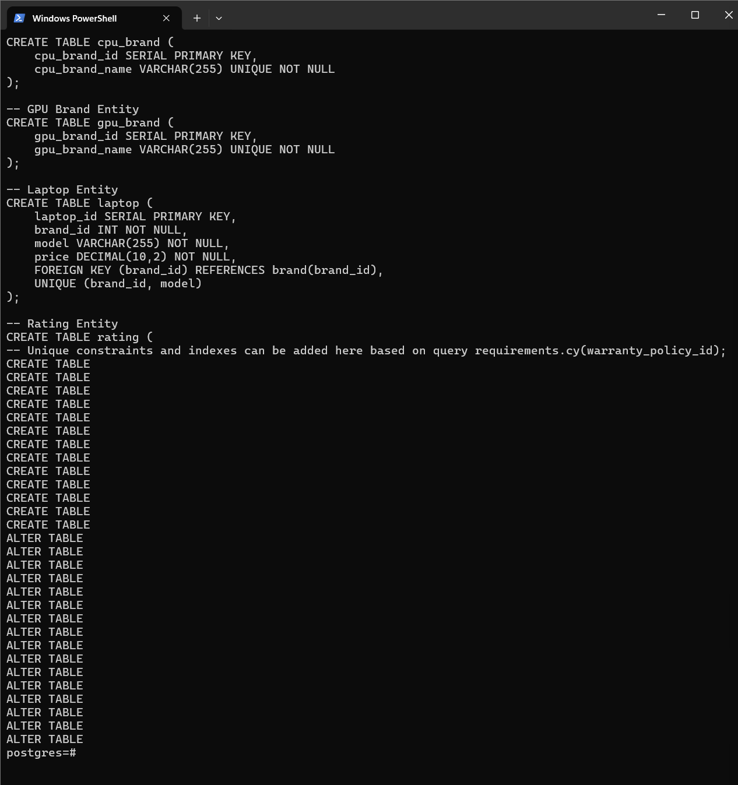

The next step is to generate DML from the csv data, I do this through a Python script `gendml.py`. It will generate all DMLs we need to the `dml.sql` file.

After executing `dml.sql`, we inserted more than a thousand pieces of data. This is a sample query after inserting.

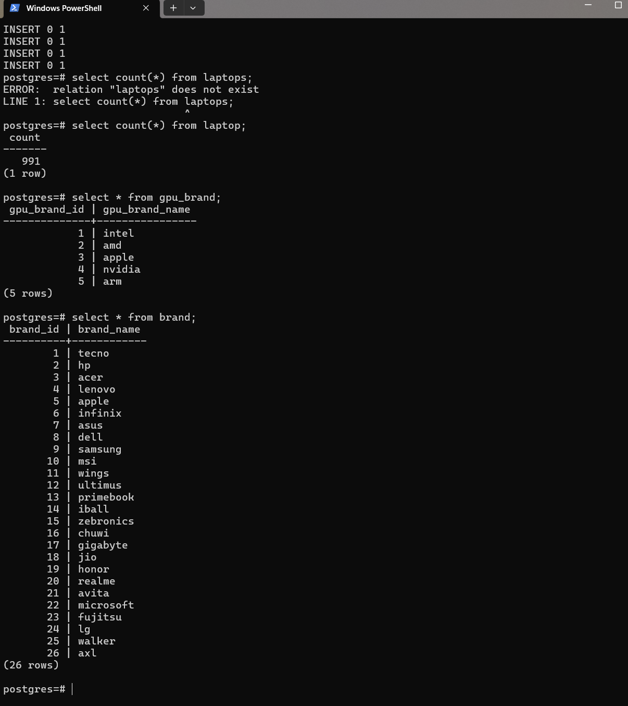

## Part 2

To ensure the database schema you've described is in Boyce-Codd Normal Form (BCNF), a level of normalization that requires every determinant to be a candidate key, we need to carefully review and potentially adjust the table structures to eliminate redundancy and ensure that every non-prime attribute is fully functionally dependent on a superkey.

**Brand, CPU Brand, and GPU Brand Tables**: These are simple tables with a primary key and a unique attribute for the name. They are already in BCNF since there are no non-prime attributes that are not fully functionally dependent on the primary key.

**Laptop Table**: This table initially contained attributes directly related to the laptop, along with foreign keys to other entities like CPU, GPU, etc. To maintain BCNF, we ensure that each of these foreign keys is fully functionally dependent on the laptop's primary key, which they are. Any attribute d  irectly describing the laptop (like price, model) is functionally dependent on the primary key.

**Component Tables (CPU, GPU, RAM, Storage_1, Storage_2, Screen, OS, Warranty Policy)**: Each of these tables has attributes that are fully functionally dependent on their respective primary keys. For entities like CPU, where the uniqueness is determined by multiple attributes (processor_brand, processor_tier, num_cores, num_threads), the combination acts as a composite primary key. To adhere to BCNF, we ensure these composite keys do not have any non-prime attributes partially dependent on them.

**Rating Table**: This table might seem straightforward but ensuring it's in BCNF means checking that the laptop_id (acting as a foreign key here) is the only determinant and that 'rating' is fully functionally dependent on it. Since each laptop has exactly one rating, this table is in BCNF.

**Laptop Components and Specifications Relationships**:

For relationships such as "Laptop have CPU," "Laptop have GPU," etc., where a laptop can have exactly one of each component, the structure supports BCNF as the relationship is captured through foreign keys in the Laptop table, each fully functionally dependent on the laptop's primary key.

In the case of optional components (like Storage_2 or Warranty Policy, where a laptop may or may not have them), allowing NULL values for their foreign keys in the Laptop table doesn't violate BCNF.

## Part 3

#### Insert Data

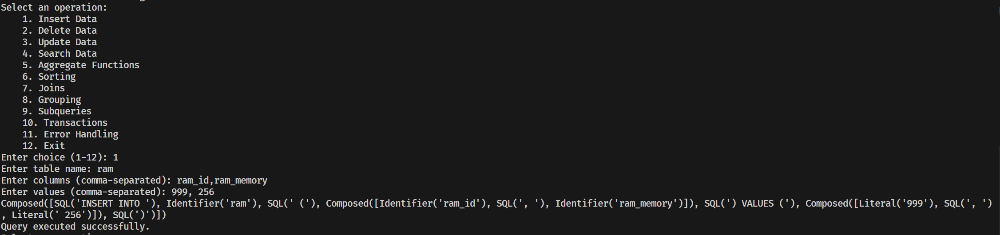

#### Delete Data

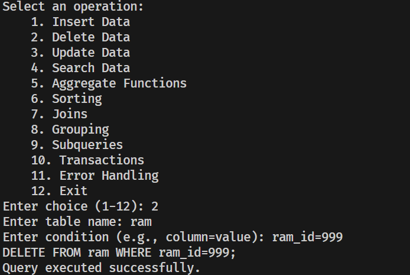

#### Update Data

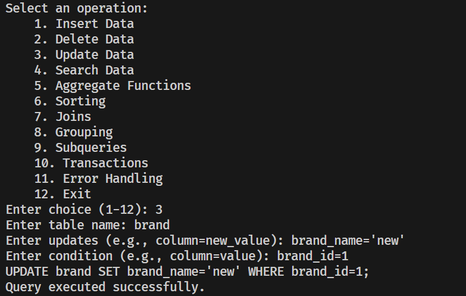

#### Search Data

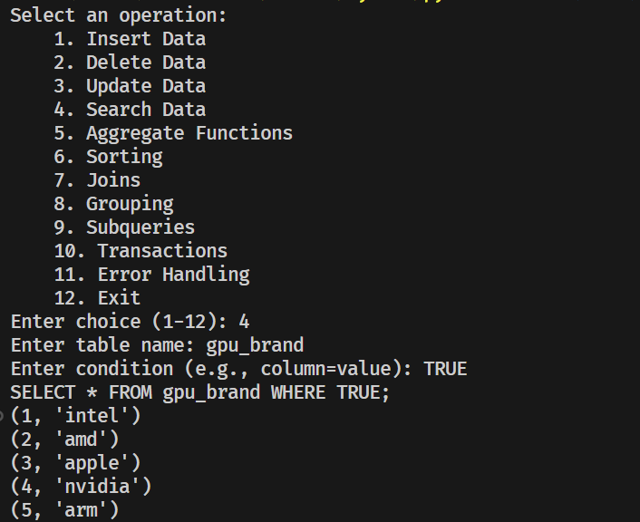

#### Aggregate Functions

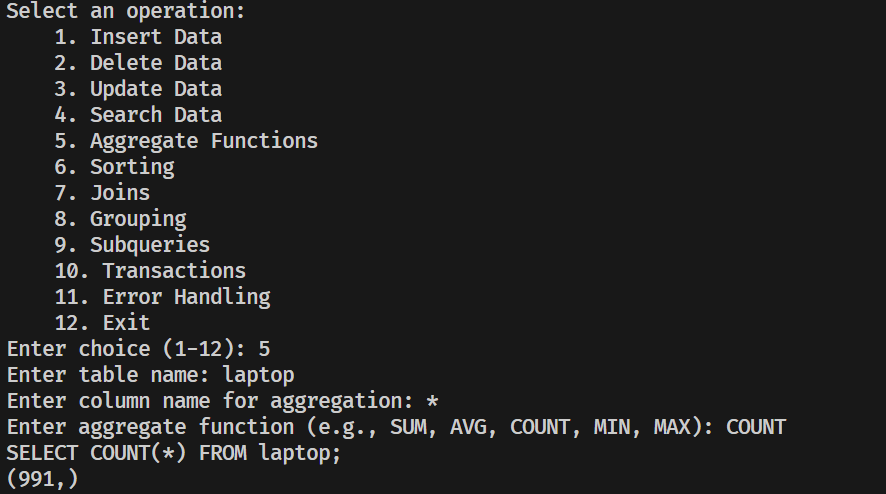

#### Sorting

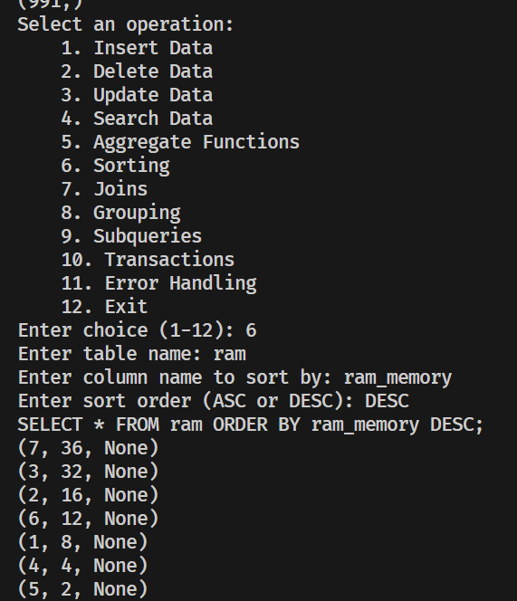

#### Join

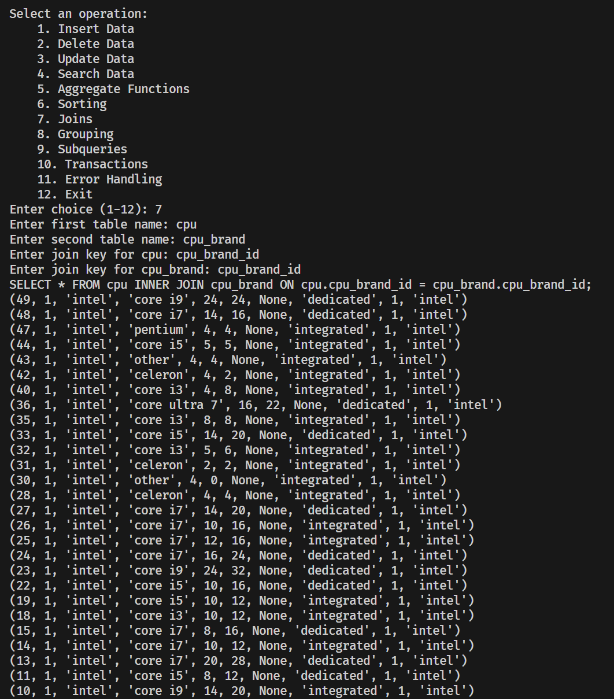

#### Grouping

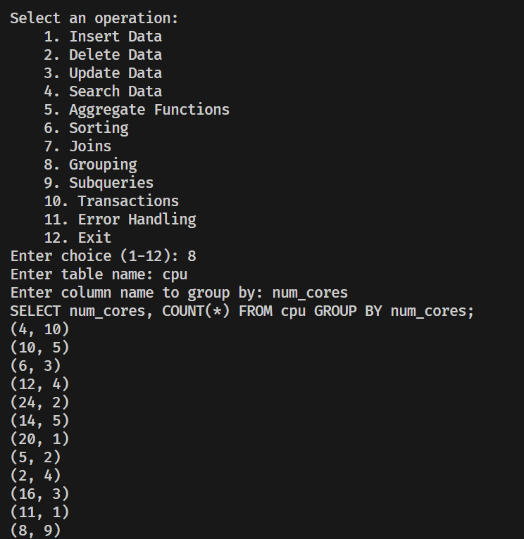

#### Subqueries

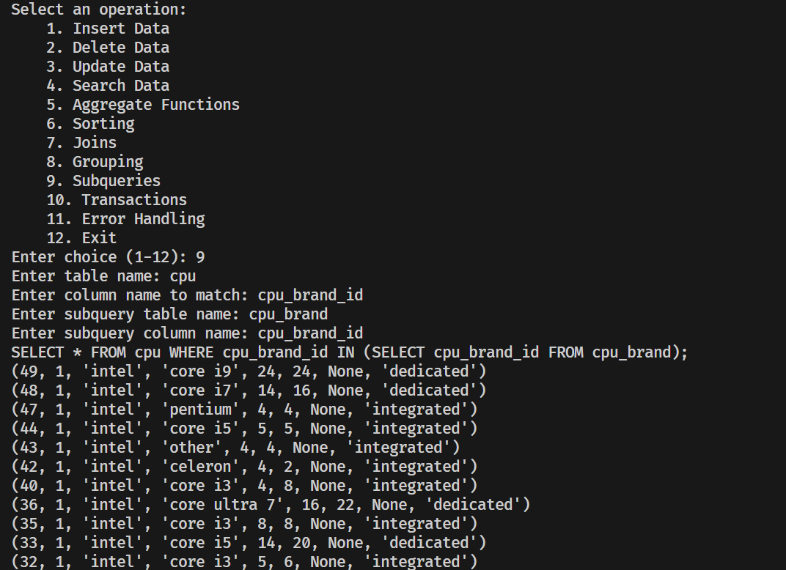

#### Transactions

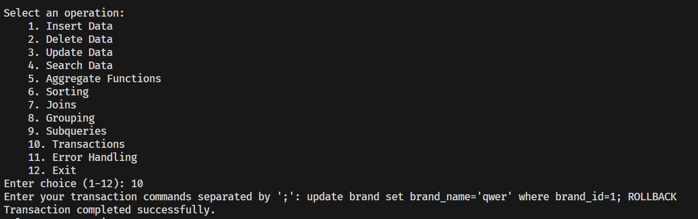

#### Error Handling

Thanks to Python's error handling and Postgresql's transaction mechanism, there is no need to deal with errors at the sql level. If an error occurs during SQL execution, the transaction is automatically rolled back.

```python
def execute_query(query, is_select=False):
    connection = None
    print(query)
    try:
        connection = connect_to_db()
        cursor = connection.cursor()
        cursor.execute(query)

        if is_select:
            results = cursor.fetchall()
            for row in results:
                print(row)
        else:
            connection.commit()
            print("Query executed successfully.")

    except (Exception, psycopg2.DatabaseError) as error:
        print(f"Error: {error}")
        if connection is not None:
            connection.rollback()
    finally:
        if connection is not None:
            cursor.close()
            connection.close()
```

## Part 4

I wrote a command line program in Python, where the user enters different commands, fills in the corresponding information, and then performs the corresponding database operations.

You can find it as `cli.py`
