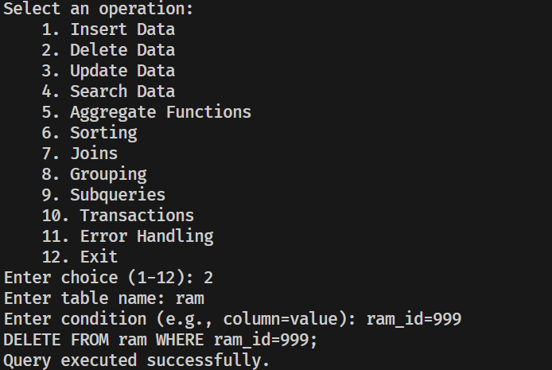
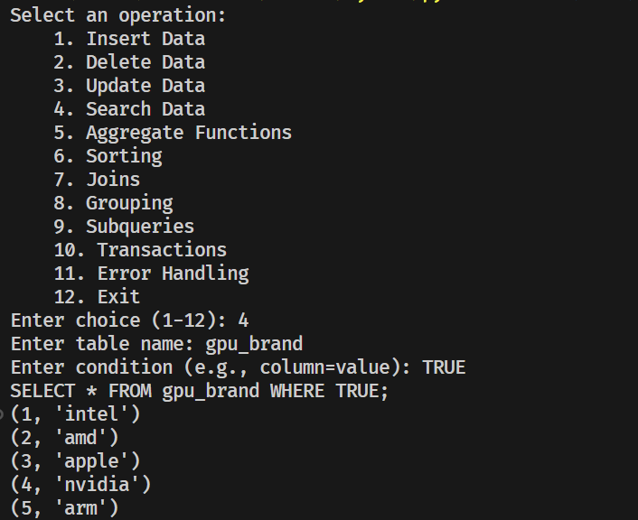
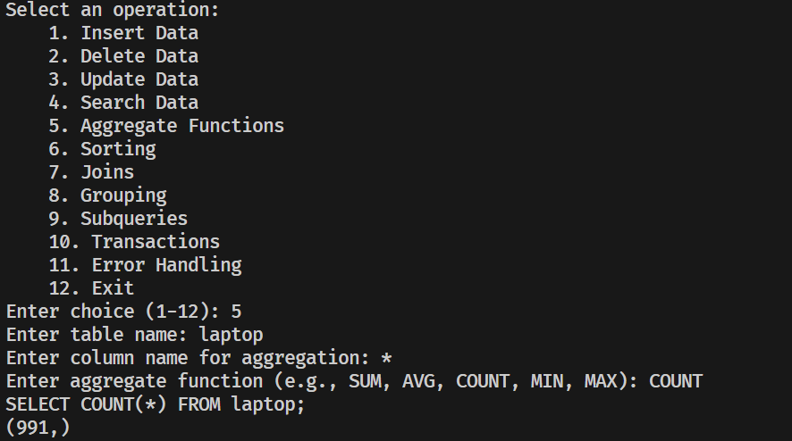
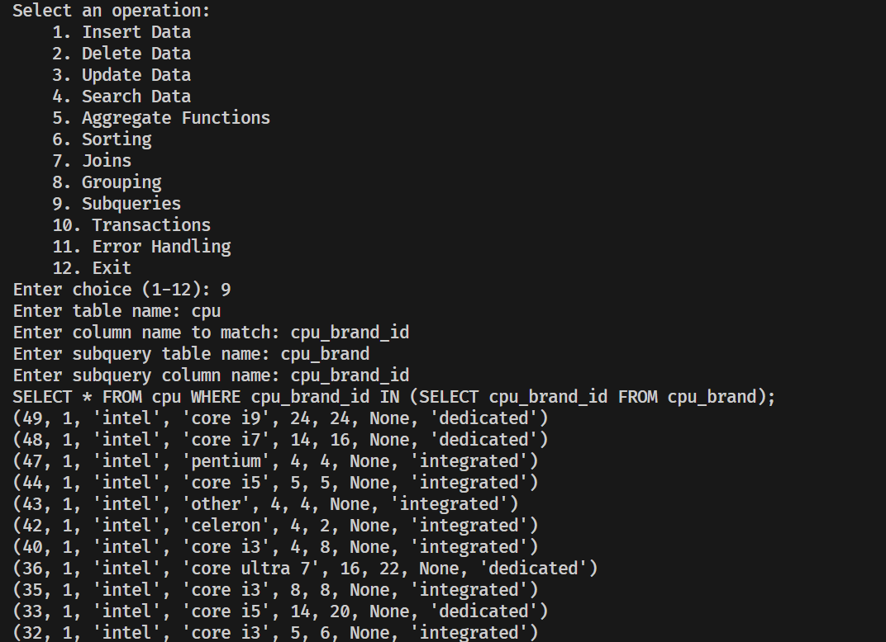

# Stage 3 Report

GITHUB: https://github.com/Tatters1996/431W-Project

### 1. Overview

The CLI interface allows users to perform various database operations such as inserting, updating, deleting, and querying data. It also supports advanced features like aggregation, sorting, joins, grouping, subqueries, transactions, and error handling.

### 2. Setup

Before using the CLI, ensure that the PostgreSQL server is running, and the psycopg2 library is installed in your Python environment.

```bash
pip install psycopg2
```

### 3. Functions

#### 3.1 `connect_to_db`

- **Purpose**: Establishes a connection to the PostgreSQL database.
- **Inputs**: None (uses hardcoded credentials).
- **Output**: Returns a connection object.
- **Usage**: This function is internally used by other functions to connect to the database.

#### 3.2 `execute_query`

- **Purpose**: Executes a given SQL query.
- **Inputs**:
  - `query`: A string containing the SQL query to be executed.
  - `is_select`: A boolean indicating whether the query is a SELECT query (defaults to False).
- **Output**: Prints the results for SELECT queries or a success message for other queries.
- **Usage**: Pass the SQL query string and specify `is_select=True` if it's a SELECT query.

#### 3.3 `main`

- **Purpose**: Provides a menu-driven interface for the user to choose and execute database operations.
- **Inputs**: User inputs for choosing operations and specifying query details.
- **Output**: Executes the selected operation and displays results or success messages.
- **Usage**: Run the script to interact with the database through the CLI.

### 4. Operations

#### 4.1 Insert Data
- **Command**: `1`
- **Inputs**: Table name, columns, and values.
- **Execution**:
  
  - Enter the table name, columns, and values when prompted.
  - The data will be inserted into the specified table.
  
  

#### 4.2 Delete Data
- **Command**: `2`

- **Inputs**: Table name and condition.

- **Execution**:
  
  - Specify the table and condition to identify which records to delete.
  
  

#### 4.3 Update Data
- **Command**: `3`
- **Inputs**: Table name, updates, and condition.
- **Execution**:
  
  - Provide details for which records should be updated and how.
  
  

#### 4.4 Search Data
- **Command**: `4`
- **Inputs**: Table name and condition.
- **Execution**:
  - Perform searches within the database based on given conditions.
  
  

#### 4.5 Aggregate Functions
- **Command**: `5`

- **Inputs**: Table name, column, and aggregation function.

- **Execution**:
  - Compute aggregate functions like SUM, AVG, etc., on specified columns.
  
  

#### 4.6 Sorting
- **Command**: `6`
- **Inputs**: Table name, column, and order.
- **Execution**:
  - Sort data based on the specified column and order.
  
  

#### 4.7 Joins
- **Command**: `7`
- **Inputs**: Two table names and their joining keys.
- **Execution**:
  - Join two tables on specified keys and retrieve combined results.
  
  

#### 4.8 Grouping
- **Command**: `8`
- **Inputs**: Table name and column.
- **Execution**:
  - Group data by the specified column and count the records in each group.
  
  

#### 4.9 Subqueries
- **Command**: `9`
- **Inputs**: Main table, column, subquery table, and subquery column.
- **Execution**:
  
  - Execute subqueries and retrieve data based on subquery results.
  
  

#### 4.10 Transactions
- **Command**: `10`

- **Inputs**: A sequence of SQL commands.

- **Execution**:
  
  - Execute multiple commands as part of a single transaction.
  
  

#### 4.11 Error Handling
- **Command**: `11`
- **Description**: Explains that error handling is integrated within each operation.

#### 4.12 Exit
- **Command**: `12`
- **Description**: Exits the program.

### 5. Running the CLI

Execute the script in your terminal or command prompt:
```bash
python script_name.py
```
Follow the on-screen prompts to perform database operations.

This documentation should help users understand and effectively use the CLI interface to interact with the PostgreSQL database.